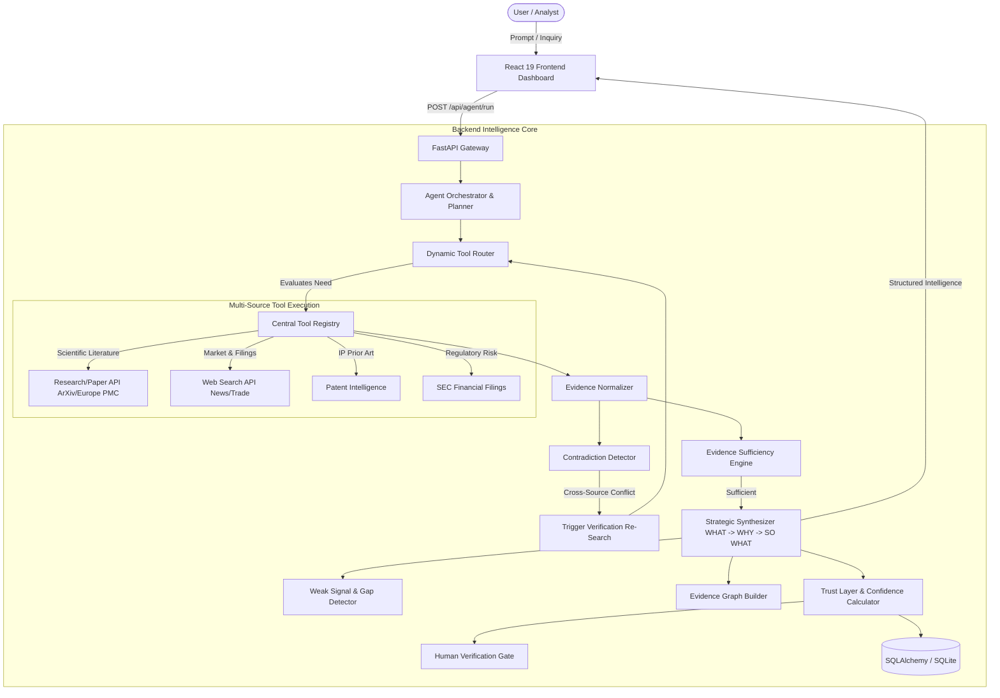

# AGENTX24 System Architecture & Technical Specification

## 1. High-Level Architecture

AGENTX24 is an autonomous Research and Competitor Intelligence AI Agent designed for deep market surveillance, scientific paper tracking, patent verification, and strategic synthesis.

---

## 2. Core Autonomous Capabilities

### 1. Autonomous Research Planning
The agent decomposes unstructured inquiries into structured sub-tasks with prioritized stopping conditions.

### 2. Dynamic Tool Selection
The tool router inspects the inquiry and existing evidence state to decide which tool to invoke next (e.g. `academic_research`, `web_search`, `patent_intelligence`, `sec_financial_filings`). It avoids redundant tool execution.

### 3. ReAct Agent Loop
A strict Reason → Act → Observe → Analyze → Decide → Re-Plan loop governed by step limits (`MAX_AGENT_STEPS = 6`).

### 4. Multi-Source Intelligence
Combines peer-reviewed academic preprints, trade news, patent filings, and statutory regulatory disclosures to eliminate single-source bias.

### 5. Sequential Tool Calling with Isolated Sandboxing
Tools are executed with strict Pydantic argument validation and sandboxed error isolation.

### 6. Evidence Sufficiency Check
Evaluates whether accumulated citations, diversity of sources, and claim coverage meet quantitative sufficiency thresholds before terminating.

### 7. Contradiction-Triggered Re-search
Automatically identifies contradictory claims (e.g., promotional press release vs. statutory SEC filing) and immediately injects a targeted cross-examination query.

### 8. WHAT → WHY → SO WHAT Synthesis
Converts technical data into an executive strategic framework:
- **WHAT**: Concrete factual development.
- **WHY**: Underlying technological and market driver.
- **SO WHAT**: Strategic threat/opportunity assessment and actionable next steps.

### 9. Opportunity / Threat Intelligence
Classifies insights by business impact, urgency, and competitive overlap.

### 10. Source Verification & Multi-Factor Credibility
Weights sources based on peer-review status, regulatory mandate, domain reputation, and timestamp proximity.

### 11. Confidence & Uncertainty Scoring
Computes composite confidence scores based on source corroboration, conflict resolution, and evidence depth.

### 12. Human Verification Gate
Flags uncertain or conflicting claims for human auditor review, signature, and persistence into the trust ledger.

### 13. Interactive Multi-Type Evidence Graph
Constructs a node-link knowledge graph linking `Competitor -> Technology -> Patent -> Research -> Trend -> Opportunity / Threat`.

### 14. Dual-Mode Operation
Supports both live API calls against external services and deterministic high-fidelity demo simulations for offline hackathon presentations.

---

## 3. Data Model & Entity Relations

- **`AgentRun`**: Tracks individual execution runs, objectives, status, and metadata.
- **`ToolCallRecord`**: Audit trail of every tool invoked, arguments, duration, and results.
- **`EvidenceItem`**: Normalized evidence items with credibility scores and source metadata.
- **`Claim` & `ClaimEvidence`**: Individual factual assertions mapped to supporting sources.
- **`Contradiction`**: Flagged cross-source inconsistencies and resolution states.
- **`VerificationLog`**: Auditor signatures, timestamps, and justification notes.
